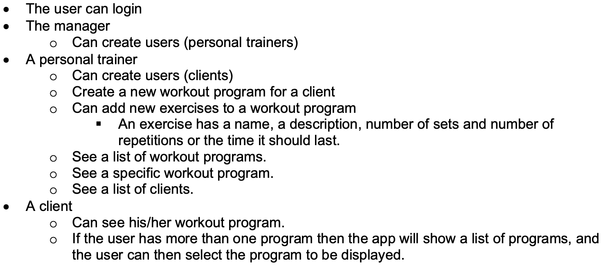

# AFE Assignment 2

# The `FitInAFart` app

## Chosen prefix = `33minators`

## Link =  https://afe-assignment-2-git-main-ts-projects-d4fc45b2.vercel.app/?_vercel_share=WfAdEccqweoKLBWDW7iRwcowu3zZQEoi

---

## Quick start

1. `cd fitinafart`
2. `npm run dev`
3. Go to http://localhost:3000

## Requirements

- Next.js
- Must include **both** server-side and client-side components
- Must be deployed to a public cloud (Vercel)

## Submission

Your submission consists of 3 parts:

1. A video where you demonstrate that your app fulfills the requirements.
2. Your solution as a zip package as described below.
3. Link to where your app is deployed.
4. Your chosen prefix.

### Before submitting your solution, do the following:

1. Delete the `node_modules` folder in the workspace root folder
2. Add a file `participants.txt` and insert a new line for each participant with the AUID and name of each member separated by whitespace
3. Add `participants.txt` to the root folder of your application
4. Archive and compress you application using zip. All other formats will result in a request for resubmission.
5. The filename should be named `<AUID_PARTICIPANT_1>-<AUID_PARTICIPANT_2>-<AUID_PARTICIPANT_3>.<ARCHIVE_COMPRESS_FORMAT>` Example: Alice with AUID `au01248` and Bob with AUID `au84210` creates a compressed archive named `au01248-au84210.zip` and uploads it to Brightspace
   Example `participants.txt` contents:
   `au01248 Alice
	au84210 Bob`

# The `FitInAFart` app

1. Video:
2. Zipped solution:
3. Link:
4. Chosen prefix: `33minators`

## Routes og todo

| **Hvad**                      | **Route**     | Hvem                          |
| ----------------------------- | ------------- | ----------------------------- |
| **Other**                     |               |                               |
| Loginside                     | /             | Unauthorized                  |
| Create Users                  | /register     | Manager Personal Trainer |
| **Personal Trainer**          |               |                               |
| New workout program           | /new-program  | Personal Trainer              |
| New exercise                  | /new-exercise | Personal Trainer              |
| Get a list of clients         | /clients      | Personal Trainer              |
| **Personal Trainer + Client** |               |                               |
| Get workout programs          | /program      | Personal Trainer, Client      |
| Get specific workout          | /program/[id] | Personal Trainer, Client      |

## Users

- Manager
  - **Email** = `33minators_boss@fitness.dk`
  - **Password** = `asdfQWER`
  - FirstName = `Manager`
  - LastName = `The Boss`
  - AccountType = `Manager`
- Personal trainers
  - 1
    - **Email** = `33minators_m@fit.dk`
    - **Password** = `aQ`
    - FirstName = `Superman`
    - LastName = `Mars`
    - AccountType = `PersonalTrainer`
  - 2
    - **Email** = `33minators_w@fit.dk`
    - **Password** = `aZ`
    - FirstName = `Superwoman`
    - LastName = `Venus`
    - AccountType = `PersonalTrainer`
- Clients
  - 1
    - **Email** = `33minators_c1@fit.dk`
    - **Password** = `aA`
    - FirstName = `John`
    - LastName = `Doe`
    - AccountType = `Models.Enums.Role.Client`
    - PersonalTrainerId = `2`
  - 2
    - **Email** = `33minators_c2@fit.dk`
    - **Password** = `aA`
    - FirstName = `Jane`
    - LastName = `Doe`
    - AccountType = `Models.Enums.Role.Client`
    - PersonalTrainerId = `3`
